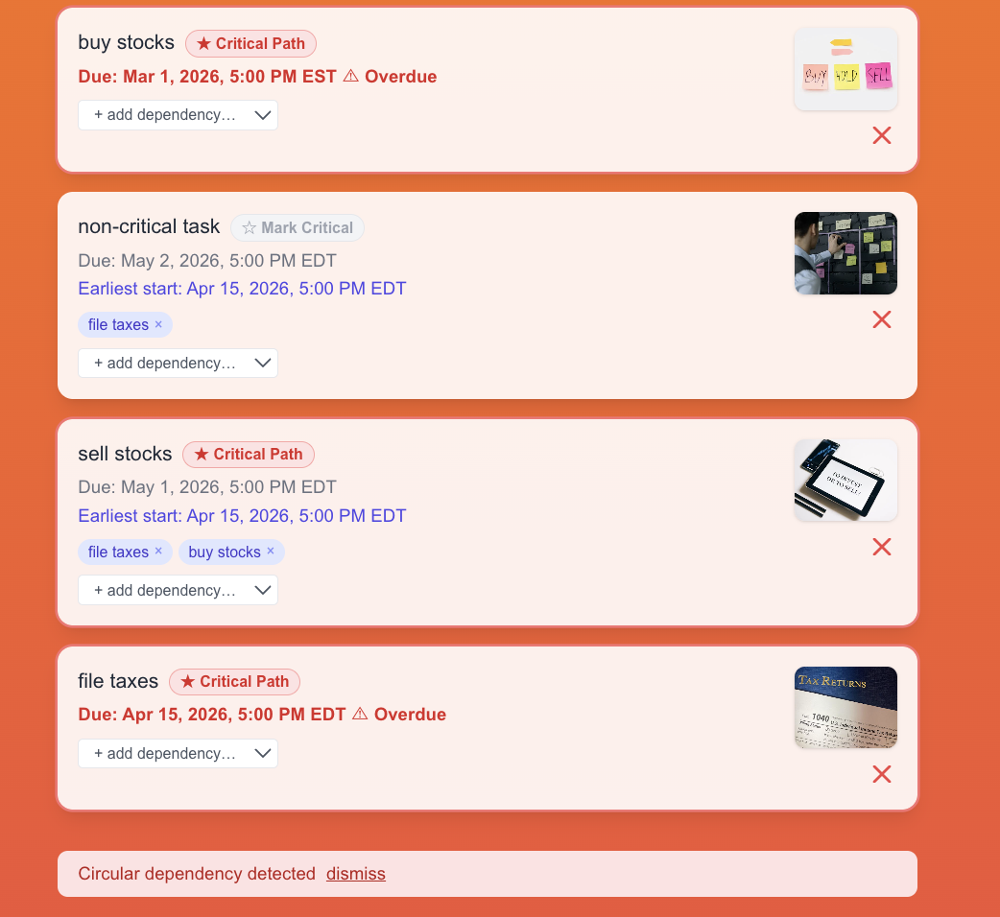

## Soma Capital Technical Assessment

This is a technical assessment as part of the interview process for Soma Capital.

> [!IMPORTANT]  
> You will need a Pexels API key to complete the technical assessment portion of the application. You can sign up for a free API key at https://www.pexels.com/api/  

To begin, clone this repository to your local machine.

## Development

This is a [NextJS](https://nextjs.org) app, with a SQLite based backend, intended to be run with the LTS version of Node.

To run the development server:

```bash
npm i
npm run dev
```

> [!NOTE]
> Create a `.env.local` file in the project root with your Pexels API key:
> ```
> PEXELS_API_KEY=your_api_key_here
> ```

## Task:

Modify the code to add support for due dates, image previews, and task dependencies.

### Part 1: Due Dates 

When a new task is created, users should be able to set a due date.

When showing the task list is shown, it must display the due date, and if the date is past the current time, the due date should be in red.

### Part 2: Image Generation 

When a todo is created, search for and display a relevant image to visualize the task to be done. 

To do this, make a request to the [Pexels API](https://www.pexels.com/api/) using the task description as a search query. Display the returned image to the user within the appropriate todo item. While the image is being loaded, indicate a loading state.

You will need to sign up for a free Pexels API key to make the fetch request. 

### Part 3: Task Dependencies

Implement a task dependency system that allows tasks to depend on other tasks. The system must:

1. Allow tasks to have multiple dependencies
2. Prevent circular dependencies
3. Show the critical path
4. Calculate the earliest possible start date for each task based on its dependencies
5. Visualize the dependency graph

## Submission:

1. Add a new "Solution" section to this README with a description and screenshot or recording of your solution. 
2. Push your changes to a public GitHub repository.
3. Submit a link to your repository in the application form.

Thanks for your time and effort. We'll be in touch soon!

## Solution


### Part 1: Due Dates

Due dates are stored as full UTC timestamps in SQLite via Prisma. When a user picks a date, the frontend attaches a **5:00 PM Eastern Time** deadline, using the `Intl.DateTimeFormat` API to resolve the correct UTC offset for that specific date (handling EST vs. EDT automatically). Dates are displayed in the `America/New_York` timezone with the abbreviation shown (e.g. *May 1, 2026, 5:00 PM EDT*). Past-due tasks render the date in red with an "⚠ Overdue" label.

### Part 2: Image Generation

On todo creation, the API immediately creates the DB record and returns it to the client (so the UI updates instantly), then fires a **non-blocking** fetch to the Pexels Search API using the task title as the query. Once the image URL is retrieved, the record is updated in the background. The frontend polls every 2 seconds while any newly-created todo is still awaiting an image, and shows an animated **pulse skeleton** in place of the image during that window. The Pexels image host is whitelisted in `next.config.mjs` for Next.js image optimization.

### Part 3: Task Dependencies

Dependencies are modelled as a **self-relation** on the `Todo` table (`dependencies` / `dependents`). Before connecting a new dependency, the API runs a **DFS cycle check** (`lib/graph.ts`) and returns HTTP 409 if the link would create a cycle — the frontend surfaces this as an inline error message.


**Earliest start date** is computed client-side as the maximum due date across all direct dependencies, giving the soonest a task can begin once its prerequisites are done.

**Critical path** is **manually set** — each task has a toggle button ("☆ Mark Critical" / "★ Critical Path") backed by an `isCritical` boolean in the DB. This was a deliberate choice over automatic computation: in a real project, teams decide what's critical based on business context, not just chain length.

**Dependency graph** is rendered with [React Flow (`@xyflow/react`)](https://reactflow.dev). Nodes marked as critical path are highlighted in red; edges between two critical nodes animate. The graph is shown below the task list whenever at least one dependency exists.
